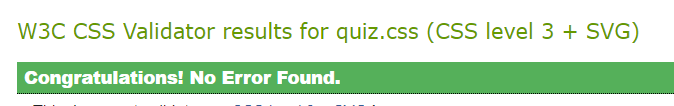

## Contents
- [Quiz website](#quiz-website)
- [UX](#ux)
- [Technologies Used](#technologies-used)
- [Testing](#testing)
- [Deployment](#deployment)
- [Credits](#credits)

# Quiz website 
Quiz website was designed as an interactive front-end website and uses mainly HTML, CSS and JavaScript technologies. This project demonstrates my skills obtained while studying the Interactive Frontend Development modules of the Code Institute’s Full Stack Developer course.

# UX

## Who is this website for?
For anyone who likes to play quizzes or games.

## What it is that they want to achieve?
Users would like to receive various questions to answer, know if their answer is correct/incorrect and how well they did on the quiz in the end. 

## How does the project fulfil the users’ needs?
Random multi-choice questions are displayed to a quiz player. S/he is able to click on one of the answers and immediately get the feedback whether it was correct or not. At the end of the quiz the player sees their total score and corresponding message depending on the score. Implemented user requirements are added below in the User Stories section.

## Wireframes
The [wireframes](https://github.com/AnaStasia1331/ms2-quiz/tree/master/assets/images/wireframes) were created using Balsamiq tool.

## User Stories 
As a quiz player, I want to:

1. navigate throughout the website with intuitive web design;
2. be able to start the quiz from the Home page; 
3. see different quiz questions displayed with multiple options to choose from;
4. see my total score of correct answers while I'm playing the quiz;
5. see the question counter to know how many questions are left to answer;
6. click on an answer and receive the immediate feedback if it's correct or not;
7. go to the final page where it's stated how well I did;
8. be able to receive emails about new quizzes loaded on the website;
9. get message about the invalid email address I entered when trying to subscribe to quizzes updates. 
10. be redirected to the Home page after I finish the quiz as I may want to play one more time.

As a quiz owner, I want to:
1. be notified when a quiz player wishes to subscribe to quiz website updates.

## Nice-to-have features (not Implemented)
- Add the Help icon located on the Home page. It should expand on click and provide the instructions for the quiz.
- Improve validation by not accepting the loading of finish-quiz.html without the 'score' url parameter.

# Technologies Used

The below list includes all of the languages, frameworks, tools, learning platforms and stock image websites I have used to create this project. 
## Languages Used
- [HTML](https://en.wikipedia.org/wiki/HTML5)
- [CSS](https://en.wikipedia.org/wiki/CSS)
- [JavaScript](https://en.wikipedia.org/wiki/JavaScript)
## Frameworks
- [Bootstrap 4.6](https://getbootstrap.com/docs/4.6/getting-started/introduction/)
    - used Bootstrap components to design the responsive website faster.
- [JQuery 3.6.0](https://jquery.com/)
    -  a JavaScript library that simplifies JavaScript programming.
## Exteral APIs
- [EmailJS](https://www.emailjs.com/)
    - external API used to send emails to owner of the website and a user when the user subscribes to quizzes updates.
- [Open Trivia Database](https://opentdb.com/)
    - external API used to retrieve questions and answers for the quiz.
## IDE and VCS
- [Git](https://git-scm.com/)
    - used as a version control system.
- [GitHub](https://github.com/)
    - used as a web-based platform to store and share the project.
- [Gitpod](https://www.gitpod.io/)
    - used as a cloud-based integrated developer environment.
## Font, wireframes and media
- [Google fonts](https://fonts.google.com/specimen/Quicksand)
    - used to import 'Quicksand' font.
- [Balsamiq](https://balsamiq.com/wireframes/)
    - used for creation of wireframes.
- [Flaticon images](https://www.flaticon.com/free-icon/quiz_3400739?term=quiz&page=1&position=25&page=1&position=25&related_id=3400739&origin=tag)
    - favicon image is downloaded from this website.
- [Freepik images](https://www.freepik.com/free-vector/quiz-background-with-flat-objects_1022603.htm#page=1&query=quiz&position=36)
    - home page image is downloaded from this website.
- [Giphy](https://giphy.com/)
    - 3 gifs are downloaded from this website to show them on the Finish quiz page. Different gifs displays depending on total score of correct answers.
- [ColorPick Eyedropper](https://chrome.google.com/webstore/detail/colorpick-eyedropper/ohcpnigalekghcmgcdcenkpelffpdolg)
    - a Chrome plugin that was used to choose a desired color code.
## Debugging 
- [Chrome dev tools](https://developers.google.com/web/tools/chrome-devtools)
    - modify CSS on-the-fly, test responsiveness, simulate slow network for testing the page loader; 'Console' and 'Sources' tab were helpful in debugging JS code.
## Learning platforms 
- [Code Institute learning platform](https://codeinstitute.net/)
    - used to revise the theory of JavaScript Essentials and Interective Frontend Development modules, find solutions for JS/JQuery issues.
- [W3schools](https://www.w3schools.com/)
    - used to revise the theory of CSS/JS/JQuery and find solutions for code issues.
- [Stack Overflow](https://stackoverflow.com/)
    - used to find answers to challenging coding questions.
## Code Validators
- [JavaScript validator](https://jshint.com/)
    -  a static code analysis tool used for checking if JavaScript source code complies with coding rules.
- [Jigsaw](https://jigsaw.w3.org/css-validator/validator)
    - tool for css validation.
- [W3C validator](https://validator.w3.org/)
    - tool for html validation.
- [Lighthouse](https://developers.google.com/web/tools/lighthouse)
    - tool for perfomance, accessibility validation.

# Testing
## Test environments
Google Chrome dev tool was used during development to make sure the website is responsiveness. The final testing of the deployed site was performed on the devices:
- Laptop HP ZBook 15 G3, 1920x1080-pixel screen resolution, Google Chrome browser.
- Iphone XR with 1792 x 828-pixel screen resolution, Safari browser.

## Testing User Stories from User Experience (UX) Section

1. ***As a quiz player, I want to navigate throughout the website with intuitive web design.***
    1. When a user enters the url of the website, s/he sees [the background image that contains the test 'Quiz' with one big Start button](https://github.com/AnaStasia1331/ms2-quiz/tree/master/assets/images/test-evidence/home-page.png) placed in the middle of the screen. Hovering the button changes its css showing that it's clickable.
    2. When the user visits the Question card page and hovers one of the answers, the cursor and light blue highlighting appears indicating that this option can be selected. 
    3. Selecting an answer will result in red or green highlighing of that answer. In such way the user knows if her/his answer was correct or wrong. Additionally, the Correct answers counter will keep track of the total number of correct answers guessed by the user.
    4. The Question counter on the Question card will keep the user informed of how many questions left to answer.
    5. A new question loads automatically after the previous answer was validated.
    6. When the user is sent to the Finish quiz page, s/he can click the Subscribe checkbox. As soon as the checkbox selected, s/he won't be allowed to finish the quiz without entering correct email address. If the checkbox unselected, clicking the Finish button should be possible without filling in email address.
2.  ***As a quiz player, I want to be able to start the quiz from the Home page.***
    1. The user can click the Start button from the Home page and s/he will be redirected to the Question card with the first question.
3. ***As a quiz player, I want to see different quiz questions displayed with multiple options to choose from.***
    1. The Question card page displays [the card with a question and possible answers](https://github.com/AnaStasia1331/ms2-quiz/tree/master/assets/images/test-evidence/question-card.png) to select. There are 10 questions in total. It's been tested that none of the questions are repeating and the answers are re-shuffled so that it won't be so easy for the user to guess the correct one.
4. ***As a quiz player, I want to see my total score of correct answers while I'm playing the quiz.***
    1. In the Question card the user can see the Correct answers counter which is initially set to 0. 
    2. As soon as a correct answer is selected, the counter increases by 1.
5. ***As a quiz player, I want to see the question counter to know how many questions are left to answer.***
    1. In the Question card the user can see the Questions counter which is initially set to 1/10. 
    2. As soon as the next question is loaded, the first number of the counter increases by 1.
6. ***As a quiz player, I want to click on an answer and receive the immediate feedback if it's correct or not.***
    1. When the user clicks on correct answer, it's highlighted in green. It's been tested by looking up the correct answer for a specific question in the json response received from [Open Trivia DB API](https://opentdb.com/) and comparing with the selected answer.
    2. When the user clicks on incorrect answer, it's highlighted in red. 
7. ***As a quiz player, I want to go to the final page where it's stated how well I did.***
    1. After going through all questions, the user is automatically redirected to the [Finish quiz page](https://github.com/AnaStasia1331/ms2-quiz/tree/master/assets/images/test-evidence/finish-quiz-page.png).
    2. At the top of the page, the message is displayed to the user informing about the summed number of correct answers. It's been tested that the final number is indeed represented by the sum of the correct answers guessed when taking the quiz.
    3. Depending on number of correct answers (ranges: score 7-10, score 4-6, score 0-3), the user sees different GIF relevant to her/his score. 
    4. Depending on number of correct answers (ranges: score 7-10, score 4-6, score 0-3), the user sees different text messages relevant to her/his score.
8. ***As a quiz player, I want to be able to receive emails about new quizzes loaded on the website.***
    1. The Finish quiz page shows the checkbox with the text: 'Subscribe to updates on new quizzes'
    2. By default the [checkbox is unselected](https://github.com/AnaStasia1331/ms2-quiz/tree/master/assets/images/test-evidence/unselected-checkbox.png) and the email address field is disabled.
    3. When the user [selects the checkbox](https://github.com/AnaStasia1331/ms2-quiz/tree/master/assets/images/test-evidence/selected-checkbox.png), s/he is able to type an email address.
    4. If the checkbox is unselected again, [the entered email address will be cleared](https://github.com/AnaStasia1331/ms2-quiz/tree/master/assets/images/test-evidence/clear-email-field.mp4). 
    5. When the user enters correct email address and clicks the Finish button, s/he will be redirected back to the Home page and receives [the auto-reply email](https://github.com/AnaStasia1331/ms2-quiz/tree/master/assets/images/test-evidence/successful-subscription.png) about the successful subscription.
9.  ***As a quiz player, I want to get message about the invalid email address I entered when trying to subscribe to quizzes updates.***
    1. When the user clicks the Subscribe checkbox, doesn't enter email and clicks the Finish button, s/he will see [the error message](https://github.com/AnaStasia1331/ms2-quiz/tree/master/assets/images/test-evidence/empty-email-error.png) telling the email address cannot be empty.
    2.  When the user clicks the Subscribe checkbox, enters invalid email and clicks the Finish button, s/he will see [the error message](https://github.com/AnaStasia1331/ms2-quiz/tree/master/assets/images/test-evidence/invalid-email-error.png) asking to enter valid email address.
10. ***As a quiz player, I want to be redirected to the Home page after I finish the quiz as I may want to play one more time.***
    1. When the user clicks the Finish button, s/he is redirected to the Home (Start)page. 
11. ***As a quiz owner, I want to be notified when a quiz player wishes to subscribe to quiz website updates.***
    1. When the user enters correct email address and clicks the Finish button, the website owner receieves [the subscription request email](https://github.com/AnaStasia1331/ms2-quiz/tree/master/assets/images/test-evidence/subscription-request.png).

## Major bugs discovered and fixed (draft):
- answers were not reshuffled;
- answer wasn't highlighted when hovered;
- validation of answers with special characters;
- email address validation: error message on empty email not shown, email with 2 dots were validated incorrectly;
-  something else?

## Known bugs:
1. Relevant for small size mobile devices. If an option text is tool long. it's wrapped but the second line is placed too close to the option numbering. Please see the [screenshot](https://github.com/AnaStasia1331/ms2-quiz/tree/master/assets/images/test-evidence/option-text-issue.png).
2. Relevant for tablet/mobile devices. It's rather an improvement than issue: the background image for the Home page contains the word 'quiz'. On bigger screens the word displays above the Start button, but on smaller screens it starts 'hidding' behind the button.

## Further Testing:

- [W3C Markup Validator](https://validator.w3.org/) was used to validate every HTML page of the project on syntax error. No issues have been detected.

- [Jigsaw](https://jigsaw.w3.org/css-validator/) service was used to validate css files. No validation errors have been detected.

- Run the JS files through [Jshint](https://jshint.com/) linter, there are warnings but no major issues.
- Lighthouse tool was used to audit performance, accessibility, best practice and SEO.
    - the results for the Home page:

    - the results for the Quiz Card page:

    - the results for the Finish Quiz page:

- misconfiguration of the external APIs:
    - tested that when calling the EmailJS service is misconfigured, the user sees the [alert](https://github.com/AnaStasia1331/ms2-quiz/tree/master/assets/images/test-evidence/fail-email-sending.png);
    - tested that when Open Trivia DB is misconfigured, the user sees 2 types of errors on [404 status](https://github.com/AnaStasia1331/ms2-quiz/tree/master/assets/images/test-evidence/404-status-load-question.png) and [other statuses](https://github.com/AnaStasia1331/ms2-quiz/tree/master/assets/images/test-evidence/general-error-load-question.png).

# Deployment

## GitHub Pages

I've published my website using GitHub Pages, a static site hosting service. To deploy a project, one should follow these steps:

1. Log into GitHub and navigate to your repository.
2. Find the Settings tab and click on it.
3. Scroll down the page until you see 'Pages' in left sub-menu.
4. In the Source sub-section choose master branch from the dropdown.
5. Save your changes. After that the message should be shown 'Your site is published at (url)'.

My project is accessible via this link https://anastasia1331.github.io/ms2-quiz/

## Run the project locally

Steps:

1. Open the repository in GitHub https://github.com/AnaStasia1331/ms2-quiz .
2. Find the Code button, choose the HTTPS clone option, copy the command.
3. Open a local directory where you want to clone the project to.
4. Open the Git Bash terminal in that directory.
5. Type the command 'git clone' plus the copied https url. 
6. After executing the command, the repository will be created in the local directory.

# Credits

## Code
## Content
## Media
## Acknowledgements
